# :blue_book:  <i class="fas fa-book" style="color: rgb(200,200,200);"></i> Report
---
<style>
.question {
   background-color: #e7f3fe;
padding: 10px;
    border-left:5px solid red;
    margin-bottom:10px;
}
<style>

<div class="question">

## Question 1 ❓

**Question:** Extract your info from the `/etc/passwd` file using the command `cat /etc/passwd`. What are the different fields? 
</div>

### Answer 


``` bash
cat /etc/passwd
```
**Output**
``` 
root:x:0:0:root:/root:/bin/bash
daemon:x:1:1:daemon:/usr/sbin:/usr/sbin/nologin
bin:x:2:2:bin:/bin:/usr/sbin/nologin
sys:x:3:3:sys:/dev:/usr/sbin/nologin
sync:x:4:65534:sync:/bin:/bin/sync
games:x:5:60:games:/usr/games:/usr/sbin/nologin
man:x:6:12:man:/var/cache/man:/usr/sbin/nologin
lp:x:7:7:lp:/var/spool/lpd:/usr/sbin/nologin
mail:x:8:8:mail:/var/mail:/usr/sbin/nologin
news:x:9:9:news:/var/spool/news:/usr/sbin/nologin
uucp:x:10:10:uucp:/var/spool/uucp:/usr/sbin/nologin
proxy:x:13:13:proxy:/bin:/usr/sbin/nologin
www-data:x:33:33:www-data:/var/www:/usr/sbin/nologin
backup:x:34:34:backup:/var/backups:/usr/sbin/nologin
list:x:38:38:Mailing List Manager:/var/list:/usr/sbin/nologin
irc:x:39:39:ircd:/run/ircd:/usr/sbin/nologin
gnats:x:41:41:Gnats Bug-Reporting System (admin):/var/lib/gnats:/usr/sbin/nologin
nobody:x:65534:65534:nobody:/nonexistent:/usr/sbin/nologin
systemd-network:x:100:102:systemd Network Management,,,:/run/systemd:/usr/sbin/nologin
systemd-resolve:x:101:103:systemd Resolver,,,:/run/systemd:/usr/sbin/nologin
messagebus:x:102:105::/nonexistent:/usr/sbin/nologin
systemd-timesync:x:103:106:systemd Time Synchronization,,,:/run/systemd:/usr/sbin/nologin
syslog:x:104:111::/home/syslog:/usr/sbin/nologin
_apt:x:105:65534::/nonexistent:/usr/sbin/nologin
uuidd:x:106:112::/run/uuidd:/usr/sbin/nologin
tcpdump:x:107:113::/nonexistent:/usr/sbin/nologin
taha:x:1000:1000:,10101,99999999999,999999999:/home/taha:/bin/bash
```
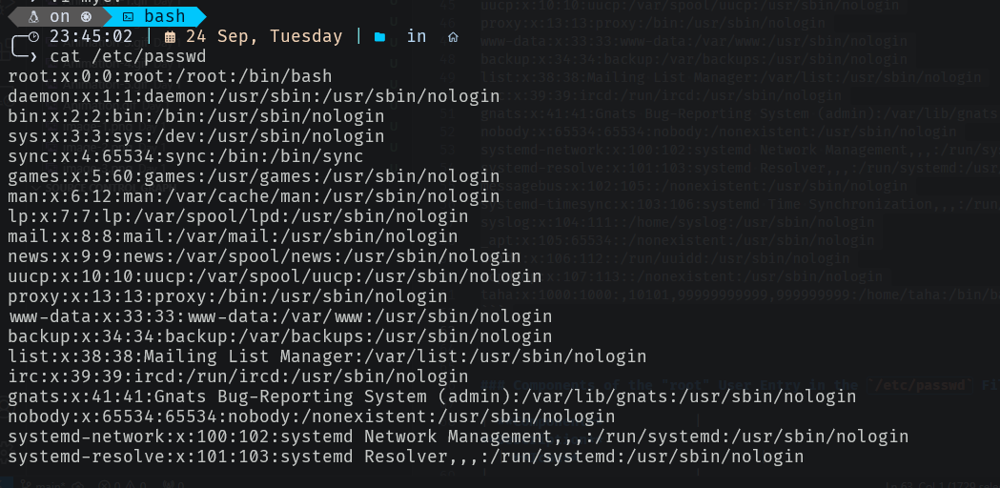


### Components of the "root" User Entry in the `/etc/passwd` File

| **Component**           | **Description**                                                                                  | **Icon**                      |
|-------------------------|--------------------------------------------------------------------------------------------------|-------------------------------|
| **Username**            | **taha**                                                                                         | 🧑‍💻                           |
| **Password Placeholder**| **x** (indicates that the password is stored in `/etc/shadow`)                                 | 🔒                            |
| **User ID (UID)**      | **1000** (the unique identifier for the user)                                                  | 🆔                           |
| **Group ID (GID)**     | **1000** (the primary group identifier for the user)                                           | 🏷️                            |
| **User Information**    | **(not provided in this case)**                                                                  | ℹ️                             |
| **Home Directory**      | **/home/taha** (the path to the user's home directory)                                         | 🏡                            |
| **Default Shell**       | **/bin/bash** (the default command shell for the user)                                         | 💻                            |

---


> [!NOTE]
> The password field in the `/etc/passwd` file is set to an `x`. This indicates that user passwords are stored in a separate file, known as the shadow file located at `/etc/shadow`. Only specific programs, such as the login program, have access to this file. This change was made for security reasons, as older versions of Linux stored encrypted passwords in `/etc/passwd`, making them vulnerable to attacks.
> ```bash
> ╭─ 19:51:51 |  24 Sep, Tuesday |   in  
> ╰─❯ sudo cat /etc/shadow
> [sudo] password for taha:
> root:*:19683:0:99999:7:::
> daemon:*:19683:0:99999:7:::
> bin:*:19683:0:99999:7:::
> sys:*:19683:0:99999:7:::
> sync:*:19683:0:99999:7:::
> games:*:19683:0:99999:7:::
> man:*:19683:0:99999:7:::
> lp:*:19683:0:99999:7:::
> mail:*:19683:0:99999:7:::
> news:*:19683:0:99999:7:::
> uucp:*:19683:0:99999:7:::
> proxy:*:19683:0:99999:7:::
> www-data:*:19683:0:99999:7:::
> backup:*:19683:0:99999:7:::
> list:*:19683:0:99999:7:::
> irc:*:19683:0:99999:7:::
> gnats:*:19683:0:99999:7:::
> nobody:*:19683:0:99999:7:::
> systemd-network:*:19683:0:99999:7:::
> systemd-resolve:*:19683:0:99999:7:::
> messagebus:*:19683:0:99999:7:::
> systemd-timesync:*:19683:0:99999:7:::
> syslog:*:19683:0:99999:7:::
> _apt:*:19683:0:99999:7:::
> uuidd:*:19683:0:99999:7:::
> tcpdump:*:19683:0:99999:7:::
> taha:$y$j9T$p2l.TfGpI.A2woJiQiUTv1$0.pzUvZGvwypSjtocmfRZioNpoaq4W9i0qEXYsE8b2D:19854:0:99999:7:::
> ```


### User Account Information

1. **Username**: **taha**  
2. **Password Placeholder**: **x** (indicates that the password is stored in `/etc/shadow`)  
3. **User ID (UID)**: **1000** (the unique identifier for the user)  
4. **Group ID (GID)**: **1000** (the primary group identifier for the user)  
5. **User Information**: **(not provided in this case)**  
6. **Home Directory**: **/home/taha** (the path to the user's home directory)  
7. **Default Shell**: **/bin/bash** (the default command shell for the user)  

--- 


<div class="question">

## Question 2 ❓

**Question:** What is the difference between cat and more command ? 


</div>

---
### Answer 

#### Difference Between `cat` and `more` Commands

| **Feature**            | **`cat` Command**                                   | **`more` Command**                                 |
|------------------------|-----------------------------------------------------|----------------------------------------------------|
| **Purpose**            | Used to concatenate and display the content of files. | Used to view the content of files one screen at a time. |
| **Usage**              | `cat [options] [file1] [file2] ...`               | `more [options] [file]`                            |
| **Output Method**      | Displays the entire content of a file immediately.  | Displays content page by page, allowing for easier reading of large files. |
| **Scrolling**          | Does not allow scrolling; all content is shown at once. | Allows for scrolling through content using the space bar (to move one page) or the Enter key (to move one line). |
| **Navigation**         | No built-in navigation options.                      | Supports navigation commands like `Space` (next page), `Enter` (next line), and `b` (previous page). |
| **File Types**         | Can read multiple files and concatenate them.       | Primarily used for reading text files.            |
| **Standard Use Cases** | Displaying short text files, combining files, or piping output. | Viewing long text files, such as logs or documents, interactively. |


#### Important Features of the `more` Command

##### Basic Functionality
- The `more` command allows users to view the content of text files one screen at a time, making it easier to read large files without overwhelming the terminal.

#### Some Key Commands and Their Functions

| **Command**                     | **Description**                                                            |
|---------------------------------|----------------------------------------------------------------------------|
| **`q` or `Q` or `<interrupt>`** | Exit from the `more` command, terminating the display process.            |
| **`'`**                         | Go to the place where the last search started, recovering the previous position. |
| **`=`**                         | Display the current line number you are on.                               |
| **`/<regular expression>`**     | Search for the `k`th occurrence of a regex, starting the search process. |
| **`n`**                         | Move to the next occurrence of the last searched regular expression.       |
| **`!<cmd>` or `:!<cmd>`**      | Execute `<cmd>` in a subshell, running the command in a new shell environment. |
| **`v`**                         | Start the `/usr/bin/vi` text editor at the current line, allowing editing of the file. |
| **`Ctrl-L`**                    | Redraw the screen, refreshing the display.                                 |
| **`:f`**                        | Display the current file name and line number being viewed.               |
| **`.`**                         | Repeat the previous command executed.                                      |


<div class="question">

## Question 3 ❓

**Question:** What is the difference between rm and rmdir using man? 


</div>

### Answer 
---

### Difference Between `rm` and `rmdir`

| **Feature**            | **`rm` Command**                                   | **`rmdir` Command**                             |
|------------------------|-----------------------------------------------------|-------------------------------------------------|
| **Purpose**            | Used to remove files or directories.                | Used to remove empty directories only.          |
| **Usage**              | `rm [options] [file1] [file2] ...`                 | `rmdir [options] [directory]`                   |
| **Functionality**      | Can delete files, directories, and files recursively (with the `-r` option). | Only deletes directories that are empty.        |
| **Options**            | Supports a wide range of options, such as `-r` (recursive), `-f` (force), and more. | Limited options; primarily `--ignore-fail-on-non-empty`. |
| **Confirmation**       | Prompts for confirmation if the `-i` option is used, or if trying to remove write-protected files. | Does not prompt for confirmation.                |

---

<div class="question">

## Question 4 ❓

**Question:** What is the difference between rm and rmdir using man? 
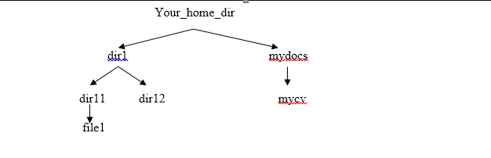
a. Remove dir11 in one step. What do you notice? And how to overcome that?
b. Then remove dir12 using rmdir –p command. State what happened to the hierarchy (Note: you are in your home dir).

</div>

### Answer 

#### Create the following hierarchy

```bash
mkdir -p dir1/dir11 dir1/dir12 mydocs/mycv
touch dir1/dir11/file1
```
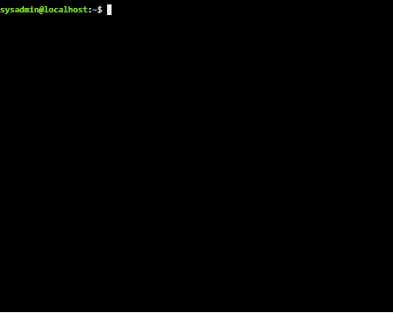

#### a. **Remove `dir11` in one step. What do you notice? And how to overcome that?**

- **Attempt to remove `dir11`**:  
  If you try to remove `dir11` with the command `rmdir dir1/dir11`, you will get an error:

  ```bash
  rmdir: failed to remove 'dir1/dir11': Directory not empty
  ```

  This happens because `dir11` contains `file1`, and `rmdir` only works on empty directories.
- **To overcome this issue**:  
  You need to use the recursive `rm` command to remove `dir11` and its contents (i.e., `file1`):

  ```bash
  rm -r dir1/dir11
  ```
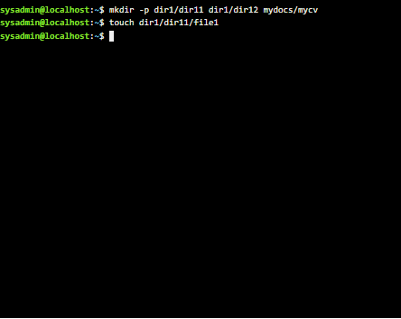

  - **Result**: `dir11` and its content (`file1`) will be removed, leaving only `dir12` under `dir1`.

#### b. **Remove `dir12` using `rmdir -p` command. State what happened to the hierarchy.**

- **Removing `dir12` with `rmdir -p`**:  
  Now, while you are in your home directory (`cd ~`), run the following command:

  ```bash
  rmdir -p dir1/dir12
  ```

  - The `-p` option with `rmdir` attempts to remove both `dir12` and its parent directory (`dir1`) if it becomes empty.
  
  **What happened**:
  - After running this command, both `dir12` and `dir1` will be removed because:
    - `dir12` is deleted first.
    - Then, since `dir1` becomes empty (because `dir11` was already deleted), `dir1` is also removed.
  

  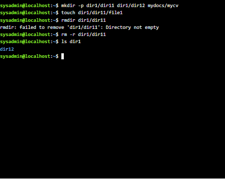
  **Resulting Hierarchy**:  
  After the above command, your home directory will no longer contain `dir1`, and only `mydocs` and `mycv` will remain.


<div class="question">

## Question 5 ❓

**Question:** Copy the `passwd` file to your home directory making its name `mypasswd`.

</div>

### Answer 

#### **Copy the `passwd` file to your home directory**

- **Command:**  
  To copy the `passwd` file to your home directory and rename it to `mypasswd`, use the following command:

  ```bash
  cp /etc/passwd ~/mypasswd
  ```


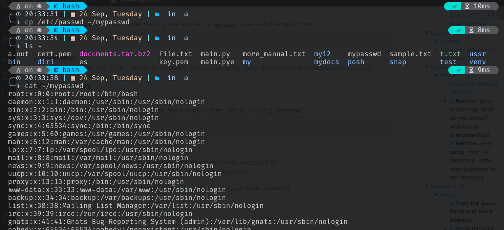


<div class="question">

## Question 6 ❓

**Question:** Rename this new file to be `oldpasswd`.

</div>

### Answer 

#### **Rename the file `mypasswd` to `oldpasswd`**

- **Command:**  
  To rename the file `mypasswd` to `oldpasswd`, use the following command:

  ```bash
  mv ~/mypasswd ~/oldpasswd
  ```
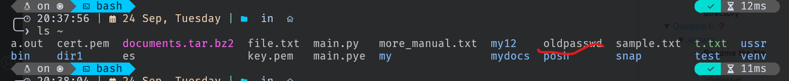


<div class="question">

## Question 7 ❓

**Question:** The output of the command `pwd` was `/home/guest50`. Write the absolute and relative path for the file `mycv`.

</div>

### Answer 

#### a. **Absolute Path for the file `mycv`**

- **Absolute Path:**  
  The absolute path for the file `mycv`, given the current working directory is `/home/guest50`, is:

  ```bash
  /home/guest50/mydocs/mycv
  ```

#### b. **Relative Path for the file `mycv`**

- **Relative Path:**  
  The relative path for the file `mycv` from the current working directory (`/home/guest50`) is:

  ```bash
  mydocs/mycv
  ```

<div class="question">

## Question 8 ❓

**Question:** You are in `/usr/bin`, list four ways to go to your home directory.

</div>

### Answer 

#### a. **Using the `cd` command with a tilde**

- **Command:**
  ```bash
  cd ~
  ```

#### b. **Using the `cd` command with the `$HOME` environment variable**

- **Command:**
  ```bash
  cd $HOME
  ```

#### c. **Using the `cd` command with the full absolute path**

- **Command:**
  ```bash
  cd /home/your_username
  ```

#### d. **Using the `cd` command with the shorthand `cd`**

- **Command:**
  ```bash
  cd
  ```


<div class="question">

## Question 9 ❓

**Question:** Display the first 4 lines of `/etc/passwd`.

</div>

### Answer 

####  **Display the first 4 lines of the file**

- **Command:**
  ```bash
  head -n 4 /etc/passwd
  ```
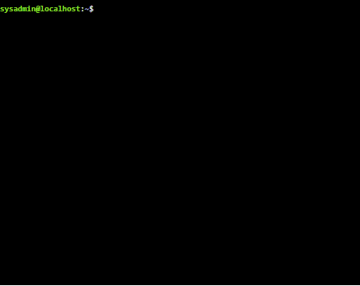

- **Explanation:**  
  This command uses `head` with the `-n` option to display the first 4 lines of the `/etc/passwd` file.


<div class="question">

## Question 10 ❓

**Question:** Display the last 7 lines of `/etc/passwd`.

</div>

### Answer 

#### a. **Using the `tail` command**

- **Command:**
  ```bash
  tail -n 7 /etc/passwd
  ```
This command will display the last 7 lines of the `/etc/passwd` file like `head`.
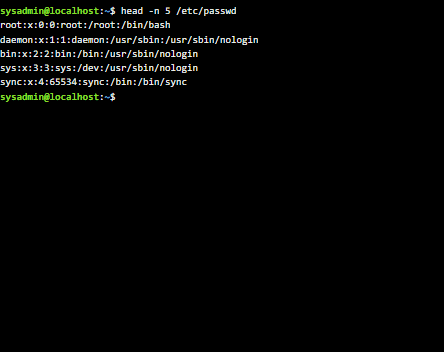
<div class="question">

## Question 11 ❓

**Question:** Display the number of user accounts in the system.

</div>

### Answer 

#### a. **Using the `wc` command**

- **Command:**
  ```bash
  wc -l < /etc/passwd
  ```

- **Explanation:**  
  This command counts the number of lines in the `/etc/passwd` file, which corresponds to the number of user accounts on the system. Each line in this file represents a user account. 


<div class="question">

## Question 11 ❓

**Question:** Display the number of user accounts in the system.

</div>

### Answer 

#### a. **Using the `wc` command**

- **Command:**
  ```bash
  wc -l < /etc/passwd
  ```

- **Explanation:**  
  This command counts the number of lines in the `/etc/passwd` file, which corresponds to the number of user accounts on the system. Each line in this file represents a user account.

#### b. **Using the `cat` command**

- **Command:**
  ```bash
  cat -n /etc/passwd
  ```
- **Explanation:**  
  The `-n` option adds line numbers to the output, displaying each line of the `/etc/passwd` file with its corresponding line number. To find the total number of user accounts, you can look at the last line number in the output. Each line indicates a separate user account. 

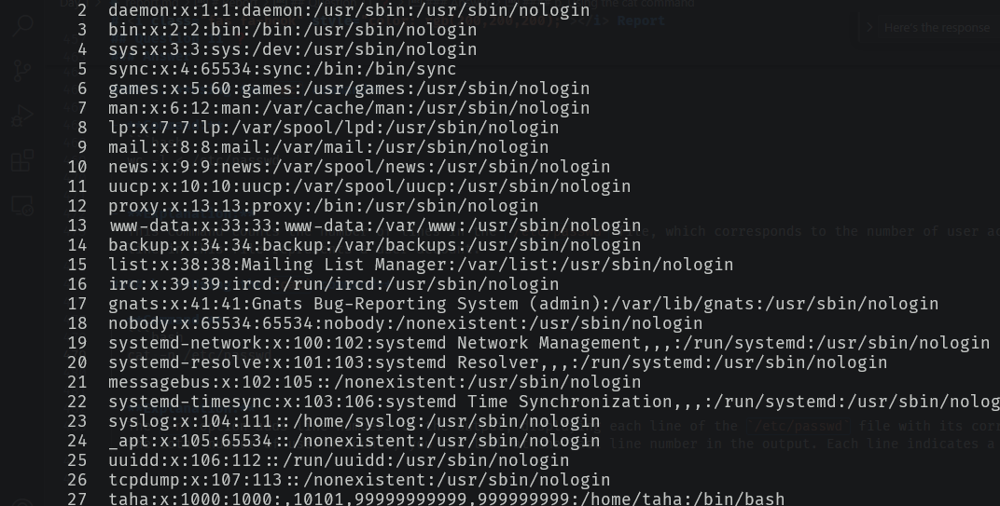
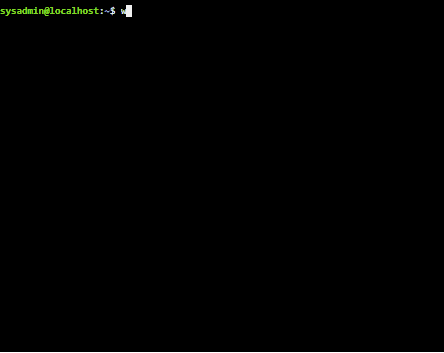


<div class="question">

## Question 12 ❓

**Question:** Display the users who are logged into the system.

</div>

### Answer 

#### a. **Using the `who` command**

- **Command:**
  ```bash
  who
  ```

- **Explanation:**  
  This command displays a list of users who are currently logged into the system, along with their terminal, login time, and other details.

#### b. **Using the `users` command**

- **Command:**
  ```bash
  users
  ```

- **Explanation:**  
  This command provides a quick list of logged-in users by showing their usernames without additional details.

#### c. **Using the `w` command**

- **Command:**
  ```bash
  w
  ```

- **Explanation:**  
  This command displays information about logged-in users and their current activity, including the username, terminal, login time, and system load.


<div class="question">

## Question 13 ❓

**Question:** Display the man pages of the `passwd` command and the `passwd` file sequentially in one command.

</div>

### Answer 

#### a. **Using the `man` command with `&&`**

- **Command:**
  ```bash
  man passwd && man 5 passwd
  ```

- **Explanation:**  
  This command first displays the man page for the `passwd` command. If the first command is successful, it then displays the man page for the `passwd` file format (section 5). The `&&` operator ensures that the second command runs only if the first command completes successfully.

#### b. **Using `man` with `;` for sequential execution**

- **Command:**
```bash
  man passwd && man 5 passwd

```
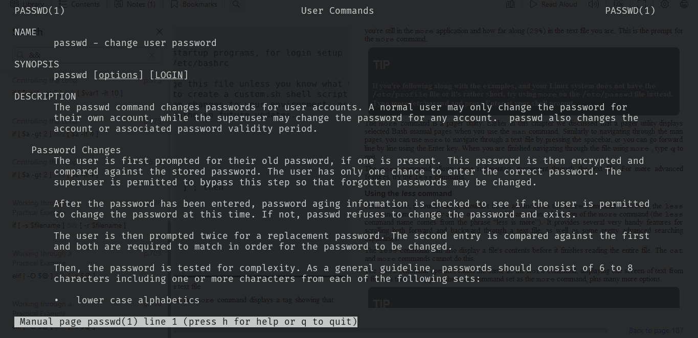

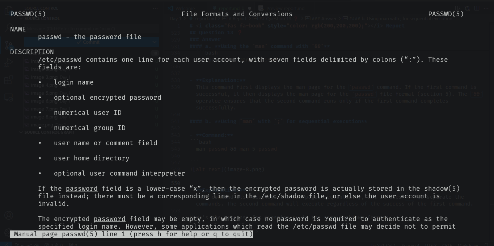

- **Explanation:**  
  This command also displays the man pages sequentially, but it uses `;` to separate the commands. The second command will execute regardless of the success of the first command.

> [!NOTE]
> to know which part comand belongs to use
> ```bash
> whatis passwd
>```
>the ouput 
>```
> passwd (1ss1)   compute password hashes
>passwd (1)      change user password
>passwd (5)      the password file  
>```
> 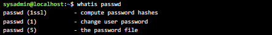
>
> as exmple i use `passwd` 
| Section Number | Area Contents                                         |
|----------------|------------------------------------------------------|
| 1              | Executable programs or shell commands                |
| 2              | System calls                                         |
| 3              | Library calls                                        |
| 4              | Special files                                        |
| 5              | File formats and conventions                          |
| 6              | Games                                                |
| 7              | Overviews, conventions, and miscellaneous            |
| 8              | Super user and system administration commands        |
| 9              | Kernel routines                                      |


<div class="question">

## Question 14 ❓

**Question:** Display the man page of the `passwd` file.

</div>

### Answer 

#### a. **Using the `man` command**

- **Command:**
  ```bash
  
  man  passwd
  
  ```
  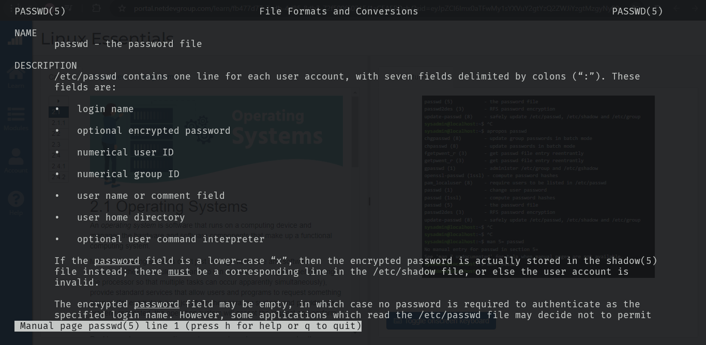

- **Explanation:**  
  This command displays the man page for the `passwd` file, which is found in section 5 of the manual. This section typically contains information about file formats and conventions. 


<div class="question">

## Question 15 ❓

**Question:** Display a list of all the commands that contain the keyword `passwd` in their man page.

</div>

### Answer 

#### a. **Using the `man` command with `-k` option**

- **Command:**

```bash
sysadmin@localhost:~$ man -k passwd
chgpasswd (8)        - update group passwords in batch mode                     
chpasswd (8)         - update passwords in batch mode                           
fgetpwent_r (3)      - get passwd file entry reentrantly                        
getpwent_r (3)       - get passwd file entry reentrantly                        
gpasswd (1)          - administer /etc/group and /etc/gshadow                   
openssl-passwd (1ssl) - compute password hashes                                 
pam_localuser (8)    - require users to be listed in /etc/passwd                
passwd (1)           - change user password                                     
passwd (1ssl)        - compute password hashes                                  
passwd (5)           - the password file                                        
passwd2des (3)       - RFS password encryption                                  
update-passwd (8)    - safely update /etc/passwd, /etc/shadow and /etc/group    

```
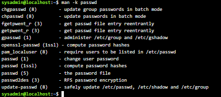
- **Explanation:**  
  This command searches the man pages for the keyword `passwd` and displays a list of all related commands and descriptions. The `-k` option is used to search the manual page names and descriptions.

#### b. **Using the `apropos` command**

- **Command:**

```bash
sysadmin@localhost:~$ apropos passwd                                            
chgpasswd (8)        - update group passwords in batch mode                     
chpasswd (8)         - update passwords in batch mode                           
fgetpwent_r (3)      - get passwd file entry reentrantly                        
getpwent_r (3)       - get passwd file entry reentrantly                        
gpasswd (1)          - administer /etc/group and /etc/gshadow                   
openssl-passwd (1ssl) - compute password hashes                                 
pam_localuser (8)    - require users to be listed in /etc/passwd                
passwd (1)           - change user password                                     
passwd (1ssl)        - compute password hashes                                  
passwd (5)           - the password file                                        
passwd2des (3)       - RFS password encryption                                  
update-passwd (8)    - safely update /etc/passwd, /etc/shadow and /etc/group    
sysadmin@localhost:~$                                                    
  
```
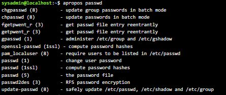
- **Explanation:**  
  This command performs the same function as `man -k passwd`, providing a list of commands that include `passwd` in their man page descriptions.

إليك الرد على السؤال 16 بنفس تنسيق الأسئلة السابقة:

<div class="question">

## Question 16 ❓

**Question:** Using `vi`, write your CV in the file `mycv`. Your CV should include your name, age, school, college, experience, etc.

</div>

### Answer 

#### a. **Open the `vi` editor**

- **Command:**
  ```bash
  vi mycv
  ```

- **Explanation:**  
  This command opens the `vi` editor and creates a new file named `mycv` if it does not already exist.

#### b. **Enter Insert Mode**

- **Action:**  
  Press `i` to enter **Insert mode** in `vi`.

#### c. **Write Your CV**

- **Content:**
  ```
  Name: Taha Samy Mohamed
  Age: 25
  School: Mahala Hassan Secondary School
  College: Higher Institute of Engineering and Technology in Kafr El-Sheikh
  Location: Cairo, Egypt
  Phone: +201097231917
  Date of Birth: 1999/01/17
  Gender: Male

  Education:
  - Higher Institute of Engineering and Technology in Kafr El-Sheikh, Computer and Control Engineering

  Skills:
  - Programming Languages: Python, JavaScript (Node.js), MATLAB
  - Data Analysis and Visualization: Pandas, NumPy, Matplotlib, Power BI, Dash, Plotly
  - Version Control and Collaboration: Git/GitHub
  - IoT Protocols: HTTP, MQTT, CoAP
  - Automation and Scripting: Excel VBA
  - Web Scraping: Selenium, BeautifulSoup
  - Web Development: HTML, CSS, Django
  - Database Management: SQL, MSSQL, ORM
  - IoT and Automation: Node-RED, Influx DB, Home Assistant
  - Networking: CCNA Skills
  - Infrastructure Management: Docker

  ```

#### d. **Save and Exit**

- **Action:**  
  Press `Esc`, then type `:wq` and press `Enter` to save the file and exit `vi`.

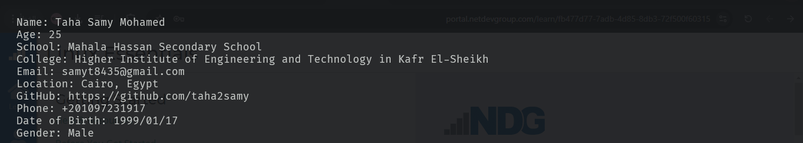

إليك كيفية فتح ملف `mycv` باستخدام أمر `vi` وتوضيح الخطوات المطلوبة:

<div class="question">

## Question 17 ❓

**Question:** Open `mycv` file using `vi` command then: 

</div>

### Answer 

#### a. **Open the `mycv` file**

- **Command:**
  ```bash
  vi mycv
  ```

- **Explanation:**  
  This command opens the `mycv` file in the `vi` editor.

#### b. **Move the cursor down one line at a time**

- **Action:**  
  Press the `j` key.

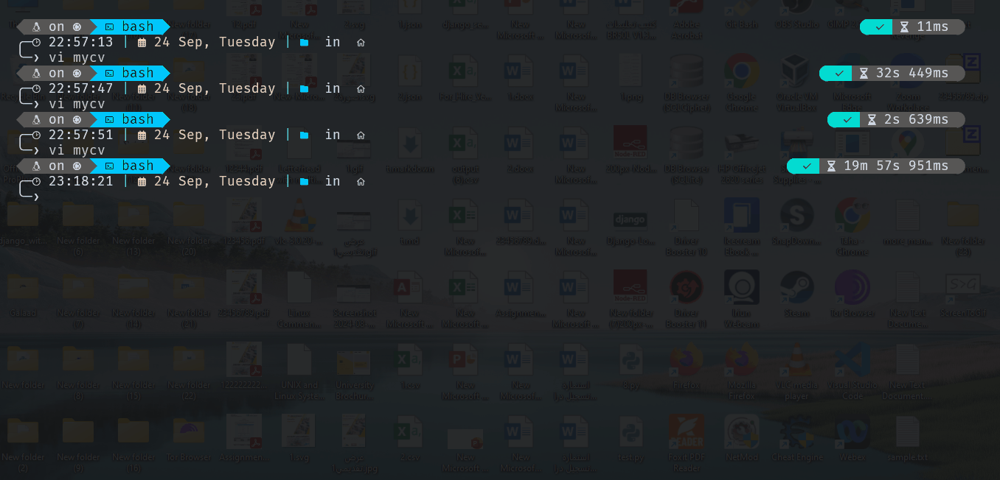


#### c. **Move the cursor up one line at a time**

- **Action:**  
  Press the `k` key.

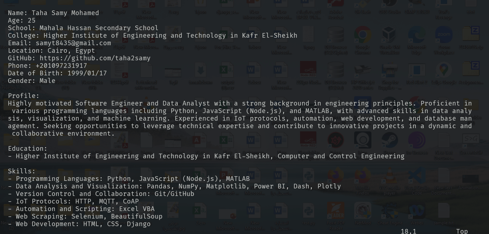

#### d. **Search for the word "age"**

- **Action:**  
  Press `/`, then type `age` and press `Enter`.

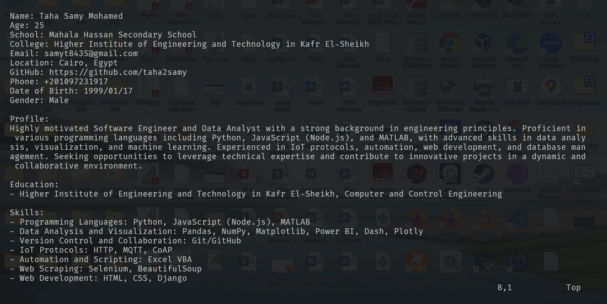

#### e. **Step to line 5 (assuming that you are in line 1 and file is more than 5 lines)**

- **Action:**  
  Type `5G` and press `Enter`.
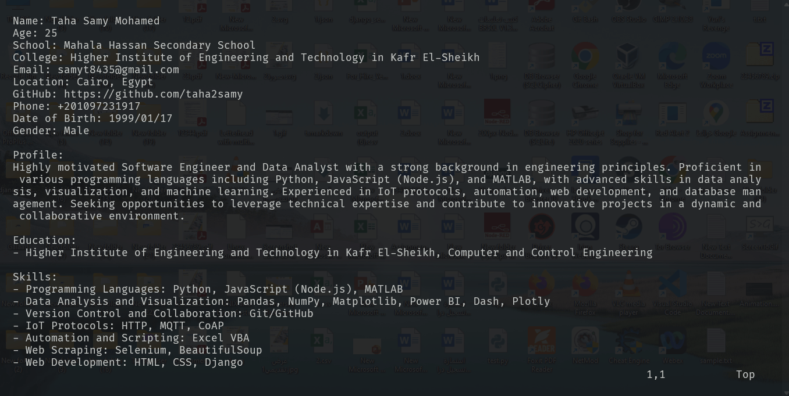

#### f. **Delete the line you are on and also line 5**

- **Action:**  
  To delete the current line, press `dd` (while on that line).  
  To delete line 5, move to line 5 using `5G` and then press `dd`.
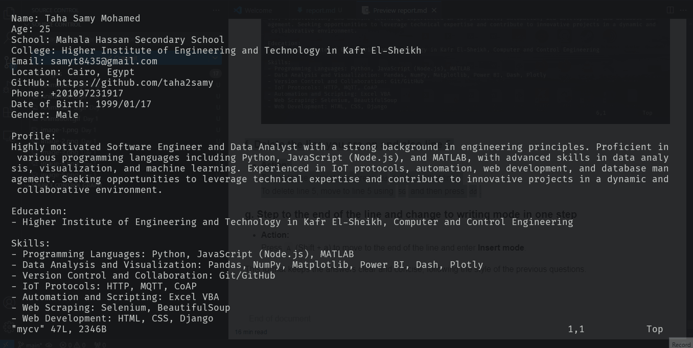

#### g. **Step to the end of the line and change to writing mode in one step**

- **Action:**  
  Press `A` (Shift + a) to move to the end of the line and enter **Insert mode**.

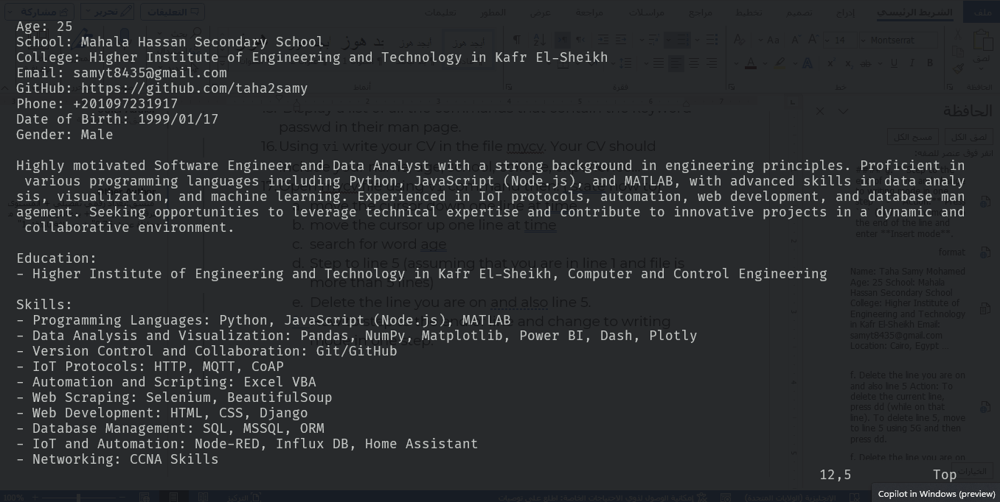
