<p align="center">
  <a href="https://skillicons.dev">
    
  </a>
</p>

## Question 1 ❓

**Question:**  
How can I change the mode of a file to give the owner read and write permissions, the group write and execute permissions, and execute only for others (using `chmod`)?


### 📝 Answer:

To change the file permissions as specified, you can use the `chmod` command in two ways:

> [!NOTE]
> Assume file is called test


1. **Numeric Method**:
   The desired permissions are:
   - **Owner (User)**: Read and write
   - **Group**: Write and execute
   - **Others**: Execute only

   The command is:
   ```bash
   chmod 631 test
   ```

2. **Symbolic Method**:
   The command using symbolic notation is:
   ```bash
   chmod u=rw,g=wx,o=x test
   ```

In this command:
- `u=rw`: Sets the owner's permissions to read and write.
- `g=wx`: Sets the group's permissions to write and execute.
- `o=x`: Sets others' permissions to execute only.

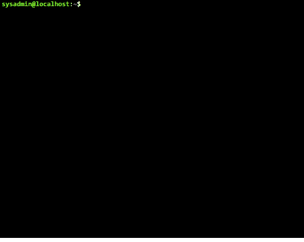
---


## Question 2 ❓

**Question:**  
How can I change my default permissions to give the owner read and write permissions, the group write and execute permissions, and execute only for others?


### 📝 Answer:

To change your default permissions in a Unix-like system, you can modify your `umask` value. The `umask` determines the default permissions assigned to newly created files and directories.

To set your default permissions to the desired values, you can use the following command in your terminal:

```bash
umask 126
```

### Explanation of the umask:

1. **Numeric Method**:

The `umask 126` will result in the following default permissions:

- **Owner**: Read and write (remains unchanged)
- **Group**: Write and execute
- **Others**: Execute only

2. **Symbolic Method**:
   To set the default permissions using symbolic notation, you can use:
   ```bash
   umask u=rw,g=wx,o=x
   ```

- The symbolic method also achieves the same result by explicitly stating the desired permissions for the user, group, and others.


  
> [!IMPORTANT]
>
> 
> Put the `umask 126` command in one of the following files:
> - `$HOME/.bash_profile`  
> - `$HOME/.bash_login`  
> - `$HOME/.profile`  
> - `$HOME/.bashrc`  
> 
> **Note:** The first three files are read in order during login. If any of these files exist, they will be executed one by one. The `$HOME/.bashrc` file is usually executed from one of these files (typically from `.bash_profile`).
> 
> Additionally:
> - `/etc/profile` is the system-wide configuration file for login shells, applied to all users.
> - Files in `/etc/profile.d/` can also be used to set environment variables and run scripts at login for specific applications or services.

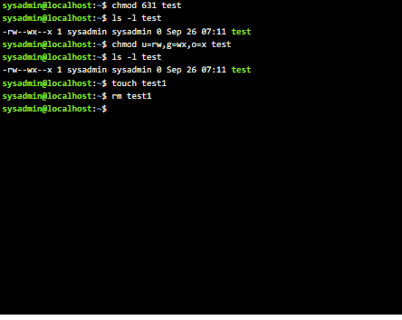

---

## Question 3 ❓

**Question:**  
What is the maximum permission a file can have, by default when it is just created? And what is that of a directory?


### 📝 Answer:

By default, the maximum permissions for files and directories depend on the `umask` setting of the user. Here's how it works:

1. **Default File Permissions:**
   - The default maximum permission for a newly created file is **666** (read and write for owner, group, and others).
   - However, due to the `umask`, which typically removes certain permissions, the actual permissions may be less than this.

   For example, if the default `umask` is **022**, the actual permissions for a new file would be:
   ```bash
   666 - 022 = 644
   ```
   Resulting in: 
   - Owner: Read and write (rw-)
   - Group: Read only (r--)
   - Others: Read only (r--)

2. **Default Directory Permissions:**
   - The default maximum permission for a newly created directory is **777** (read, write, and execute for owner, group, and others).
   - Similar to files, the `umask` will adjust these permissions.

   For example, with a `umask` of **022**, the actual permissions for a new directory would be:
   ```bash
   777 - 022 = 755
   ```
   Resulting in:
   - Owner: Read, write, and execute (rwx)
   - Group: Read and execute (r-x)
   - Others: Read and execute (r-x)

---

## Question 4 ❓

**Question:**  
Change your default permission to read and execute for you (owner), full permission for your group member, and no permission for all the others. Create a file and a directory. Note the permissions.


### 📝 Answer:

To change your default permissions and create a file and directory with the specified permissions, follow these steps:

1. **Change Default Permissions:**
   To set the `umask` for your desired permissions, use the following command:
   ```bash
   umask 007
   ```

   ### Explanation of the umask:
   - **Owner (User):** Read and execute (r-x) 
   - **Group:** Full permission (rwx) 
   - **Others:** No permission (---) 

2. **Create a File:**
   To create a new file, you can use the `touch` command:
   ```bash
   touch myfile
   ```

3. **Create a Directory:**
   To create a new directory, use the `mkdir` command:
   ```bash
   mkdir mydirectory
   ```

4. **Check Permissions:**
   After creating the file and directory, you can check their permissions using:
   ```bash
   ls -l myfile mydirectory
   ```

### Expected Permissions:

After executing the above commands, the expected permissions should be:

- **For the File (myfile):**
   - Owner: Read and execute (rw-)
   - Group: Full permission (rw-)
   - Others: No permission (---)
   - Displayed as: `-rw-rw----`

- **For the Directory (mydirectory):**
   - Owner: Read and execute (r-x)
   - Group: Full permission (rwx)
   - Others: No permission (---)
   - Displayed as: `drwxrwx---`

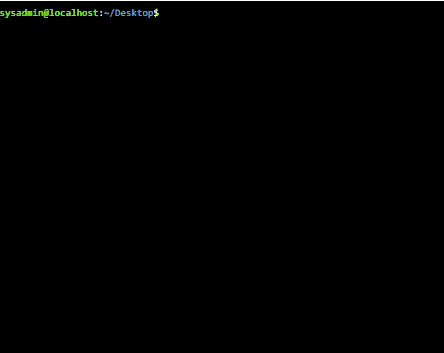

> [!NOTE]
> **file didnot get excute permission becuase it is not command or script**

---

## Question 5 ❓

**Question:**  
Copy `/etc/passwd` to your home directory. Note the permissions allowed to you before and after. Specify why?


### 📝 Answer:

1. **Check Initial Permissions:**
   Before copying the file, check your current permissions using:
   ```bash
   ls -l /etc/passwd
   ```

   ### Expected Permissions for `/etc/passwd`:
   - The typical permissions for `/etc/passwd` are:
     - Owner: Read (rw-)
     - Group: Read (r--)
     - Others: Read (r--)
   - Displayed as: `-rw-r--r--`

2. **Copy the File:**
   To copy the `/etc/passwd` file to your home directory, use the following command:
   ```bash
   cp /etc/passwd ~/
   ```

3. **Check Permissions After Copying:**
   After copying, check the permissions of the copied file in your home directory:
   ```bash
   ls -l ~/passwd
   ```

   ### Expected Permissions for the Copied File:
   - The permissions for the copied file (e.g., `passwd` in your home directory) should typically be:
     - Owner: Read and write (rw-)
     - Group: Read (r--)
     - Others: Read (r--)
   - Displayed as: `-rw-r--r--`
  
> [!NOTE]
> **Note on Permissions:**
>   - **Before Copying:** You had permissions to read the original file.
>   - **After Copying:** The copied file allows you to read and write since the default behavior of `cp` (when copying files) preserves the original permissions for the owner but applies your user’s default umask for the group and others.
> you can use option `-p` to copy with orgin permission 


>[!TIP]
>**Why This Happens:**
> - The `cp` command copies the content of the original file and retains the ownership. As a result, the copied file inherits the user’s permissions based on the current `umask` setting.
> - Since you are the owner of the copied file, you can modify its permissions through your umask settings, which is usually set to allow read and write access for the owner.


---

## Question 6 ❓

**Question:**  
What are the minimum permissions needed for:
a. Copy a directory (source and target)  
b. Copy a file (source and target)  
c. Delete a file  
d. Change to a directory  
e. List a directory content  
f. View a file content  
g. Modify a file content  


### 📝 Answer:

Here are the minimum permissions required for each of the specified actions:

### a. **Copy a Directory (Source and Target)**

- **Source Directory:** 
  - **Required Permissions:** Read (r) and Execute (x)
  - **Explanation:** You need read access to list the contents and execute access to traverse into the directory.
  
- **Target Directory:**
  - **Required Permissions:** Write (w) and Execute (x)
  - **Explanation:** You need write access to create the copied directory and execute access to access the directory.

### b. **Copy a File (Source and Target)**

- **Source File:**
  - **Required Permissions:** Read (r)
  - **Explanation:** You need read access to copy the contents of the file.

- **Target Directory:**
  - **Required Permissions:** Write (w) and Execute (x)
  - **Explanation:** You need write access to create the copied file and execute access to access the directory.

### c. **Delete a File**

- **Required Permissions:** Write (w) and Execute (x) on the containing directory
- **Explanation:** You need write access to remove the file and execute access to access the directory that contains the file.

### d. **Change to a Directory**

- **Required Permissions:** Execute (x)
- **Explanation:** You need execute access to change into the directory.

### e. **List a Directory Content**

- **Required Permissions:** Read (r) and Execute (x)
- **Explanation:** You need read access to see the contents and execute access to access the directory.

### f. **View a File Content**

- **Required Permissions:** Read (r)
- **Explanation:** You need read access to view the content of the file.

### g. **Modify a File Content**

- **Required Permissions:** Write (w)
- **Explanation:** You need write access to modify the content of the file.

> [!NOTE]
> | Action                              | Required Permissions                     |
> |-------------------------------------|-----------------------------------------|
> | a. Copy a Directory                 | Source: r, x | Target: w, x           |
> | b. Copy a File                      | Source: r | Target: w, x             |
> | c. Delete a File                   | w, x (on the containing directory)      |
> | d. Change to a Directory            | x                                       |
> | e. List a Directory Content         | r, x                                    |
> | f. View a File Content              | r                                       |
> | g. Modify a File Content            | w                                       |


## Question 7 ❓

**Question:**  
Create a file with permission 444. Try to edit it and remove it. Note what happened.  
What is the difference between the "x" permission of a file and that of a directory?


### 📝 Answer:

1. **Create a File with Permission 444:**

   To create a file with read-only permissions (444) for the owner, group, and others, use the following commands:

   ```bash
   touch myfile
   chmod 444 myfile
   ```

   - **Permissions Explanation:**
     - `444`: Read-only for owner, group, and others.
     - Displayed as: `-r--r--r--`

2. **Try to Edit the File:**

   If you try to edit the file using an editor like `nano` or `vim`, you'll receive a **write protection warning**. For example:
   
   ```bash
   nano myfile
   ```
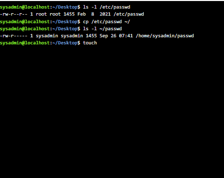
   - **Result:** The editor will inform you that the file is **read-only**, and you will be unable to save changes unless you change the file's permissions.

3. **Try to Remove the File:**

   To delete the file, use the `rm` command:
   ```bash
   rm myfile
   ```

   - **Result:** You **can** remove the file if you have write permissions on the **containing directory**. File write protection (444) only prevents modifications to the file’s content but does not stop the file from being deleted if the directory permissions allow it.


> [!IMPORTANT]
> ### Difference Between the "x" Permission of a File and a Directory:
> 
> - **"x" Permission on a File:**
>   - Grants the ability to **execute** the file as a program or script.
>   - If a file does not have the "x" permission, it cannot be executed.
>
> - **"x" Permission on a Directory:**
>   - Grants the ability to **traverse** the directory, allowing you to access files and subdirectories inside it.
>   - Without "x" permission, you cannot enter or list the directory, even if you have read permissions.


----


## Question 8 ❓

**Question:**  
Using the `useradd` command, add accounts for the following users in your system: user1, user2, user3, user4, user5, user6, and user7. Remember to give each user a password.


### 📝 Answer (Modified to use `useradd` with OpenSSL for password creation):

1. **Generate Passwords with OpenSSL**  
   To generate encrypted passwords using OpenSSL, you can use the following command for each user:

   ```bash
   openssl passwd -crypt 'password'
   ```

   Replace `'password'` with the desired password for each user. This will output an encrypted password string.

2. **Add Users with Encrypted Passwords**  
   Use the `useradd` command with the `-p` option to add users and assign the encrypted password directly:

   ```bash
   sudo useradd -m -p $(openssl passwd -crypt '123456789') user1
   sudo useradd -m -p $(openssl passwd -crypt '123456789') user2
   sudo useradd -m -p $(openssl passwd -crypt '123456789') user3
   sudo useradd -m -p $(openssl passwd -crypt '123456789') user4
   sudo useradd -m -p $(openssl passwd -crypt '123456789') user5
   sudo useradd -m -p $(openssl passwd -crypt '123456789') user6
   sudo useradd -m -p $(openssl passwd -crypt '123456789') user7
   ```

   - The `-p` option assigns the encrypted password to the user.
   - Replace `'password1'`, `'password2'`, etc., with the actual passwords you want to assign to each user.

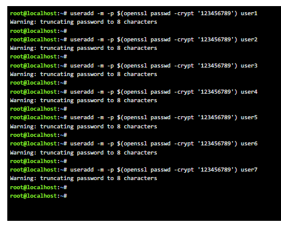

---

## Question 9 ❓

**Question:**  
Using the `groupadd` command, add the following groups to your system.

| **Group** | **GID** |
|-----------|---------|
| sales     | 10000   |
| hr        | 10001   |
| web       | 10002   |


### 📝 Answer:

To add the groups with specific GIDs, use the `groupadd` command with the `-g` option to specify the GID:

1. **Add the Sales Group:**
   ```bash
   sudo groupadd -g 10000 sales
   ```

2. **Add the HR Group:**
   ```bash
   sudo groupadd -g 10001 hr
   ```

3. **Add the Web Group:**
   ```bash
   sudo groupadd -g 10002 web
   ```

- The `-g` option specifies the GID (Group ID) for each group.

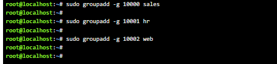


## Question 10 ❓

**Question:**  
Using the `usermod` command, add user1 and user2 to the sales auxiliary group, user3 and user4 to the hr auxiliary group, user5 and user6 to the web auxiliary group. Add user7 to all auxiliary groups.


### 📝 Answer:

To add users to auxiliary groups using the `usermod` command, you can follow the syntax below:

1. **Add user1 and user2 to the `sales` group:**

   ```bash
   sudo usermod -aG sales user1
   sudo usermod -aG sales user2
   ```

   - The `-aG` option is used to append (`-a`) the user to the specified group (`G`) without removing them from other groups.

2. **Add user3 and user4 to the `hr` group:**

   ```bash
   sudo usermod -aG hr user3
   sudo usermod -aG hr user4
   ```

3. **Add user5 and user6 to the `web` group:**

   ```bash
   sudo usermod -aG web user5
   sudo usermod -aG web user6
   ```

4. **Add user7 to all groups (`sales`, `hr`, and `web`):**

   ```bash
   sudo usermod -aG sales,hr,web user7
   ```

- **Explanation of the Command:**
  - `usermod`: Command to modify a user account.
  - `-aG`: Adds the user to the group(s) without removing them from other groups.
  - `sales`, `hr`, `web`: The auxiliary groups to which the users will be added.
  - `userX`: The username to modify.


### Summary:

- **Commands:**
  - `sudo usermod -aG sales user1`
  - `sudo usermod -aG sales user2`
  - `sudo usermod -aG hr user3`
  - `sudo usermod -aG hr user4`
  - `sudo usermod -aG web user5`
  - `sudo usermod -aG web user6`
  - `sudo usermod -aG sales,hr,web user7`

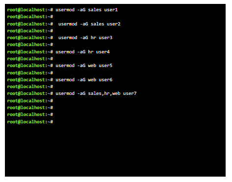


## Question 11 ❓

**Question:**  
Login as each user and use the `id` command to verify that they are in the appropriate groups. How else might you verify this information?


### 📝 Answer:

1. **Login as Each User:**
   To verify that each user is in the appropriate groups, you need to log in as each user. This can be done using the `su` (substitute user) command or by switching to the user in a terminal:

   ```bash
   su - user1
   su - user2
   su - user3
   su - user4
   su - user5
   su - user6
   su - user7
   ```

   - The `-` option ensures that you switch to the user's environment, loading their profile.

2. **Use the `id` Command:**
   After logging in as each user, run the following command to check the user's group membership:

   ```bash
   id
   ```

   - **Output Example:**
     The output will display the user ID (UID) and group ID (GID), along with the groups the user belongs to:
     ```
     uid=1001(user1) gid=1001(user1) groups=10000(sales)
     ```
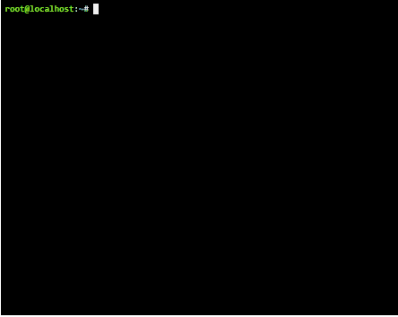

### 3. **Alternative Methods to Verify Group Membership:**

In addition to using the `id` command, there are other ways to verify group memberships:

- **Using the `groups` Command:**
   This command lists the groups a user is part of:

   ```bash
   groups
   ```

   - Output example:
     ```
     user1 : user1 sales
     ```
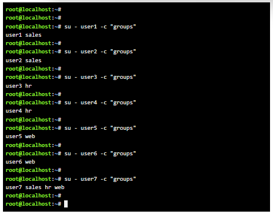
- **Checking the `/etc/group` File:**
   You can view the `/etc/group` file to see all group memberships. Each line contains the group name, password placeholder, GID, and a list of users:

   ```bash
   cat /etc/group | grep 'sales\|hr\|web'
   ```

   - This command filters the output to show only the relevant groups and their members.


## Question 12 ❓

**Question:**  
Create a directory called `/depts` with `sales`, `hr`, and `web` directories within the `/depts` directory.


### 📝 Answer:


**Create Subdirectories:**
   Now, create the `sales`, `hr`, and `web` directories within the `/depts` directory:

   ```bash
   sudo mkdir -p /depts/sales
   sudo mkdir -p /depts/hr
   sudo mkdir -p /depts/web
   ```

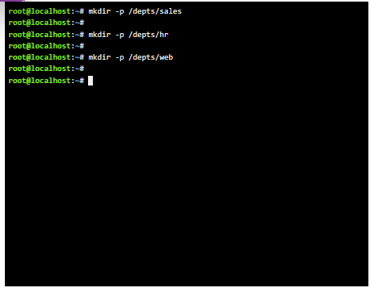
---

## Question 13 ❓

**Question:**  
Using the `chgrp` command, set the group ownership of each directory to the group with the matching name.


### 📝 Answer:

1. **Change Group Ownership for Each Directory:**
   Use the `chgrp` command to change the group ownership of each directory to match its name:

   ```bash
   sudo chgrp sales /depts/sales
   sudo chgrp hr /depts/hr
   sudo chgrp web /depts/web
   ```


## Question 14 ❓

**Question:**  
Set the permissions on the `/depts` directory to `755`, and each subdirectory to `770`.


### 📝 Answer:

1. **Set Permissions for the `/depts` Directory:**
   Use the `chmod` command to set the permissions of the `/depts` directory to `755`:

   ```bash
   sudo chmod 755 /depts
   ```

   - **Permissions Explanation:**  
     - `7`: Read, write, and execute for the owner.  
     - `5`: Read and execute for the group.  
     - `5`: Read and execute for others.  

2. **Set Permissions for Each Subdirectory to `770`:**
   Set the permissions for the `sales`, `hr`, and `web` directories to `770`:

   ```bash
   sudo chmod 770 /depts/sales
   sudo chmod 770 /depts/hr
   sudo chmod 770 /depts/web
   ```
   - **Permissions Explanation:**  
     - `7`: Read, write, and execute for the owner.  
     - `7`: Read, write, and execute for the group.  
     - `0`: No permissions for others. 
     -  
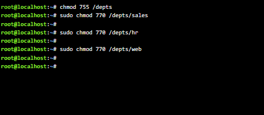

---

## Question 15 ❓

**Question:**  
Set the set-gid bit on each departmental directory.


### 📝 Answer:

1. **Set the Set-GID Bit:**
   To set the set-gid bit on the departmental directories (`sales`, `hr`, and `web`), use the `chmod` command with the `g+s` option:

   ```bash
   sudo chmod g+s /depts/sales
   sudo chmod g+s /depts/hr
   sudo chmod g+s /depts/web
   ```

   - **Set-GID Bit Explanation:**  
     Setting the set-gid bit ensures that files created in these directories inherit the group ownership of the directory, allowing users within the group to collaborate more easily.

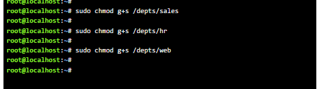
---

### Verification:
To verify the permissions and the set-gid bit, use the following command:

```bash
ls -l /depts
```
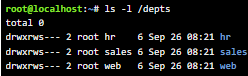
- The set-gid bit will be indicated by an `s` in the group execute position (e.g., `rwxr-s---`).


## Question 16 ❓

**Question:**  
Use the `su` command to switch to the `user2` account and attempt the following commands:

a. `touch /depts/sales/user2.txt`  
b. `touch /depts/hr/user2.txt`  
c. `touch /depts/web/user2.txt`  

Which of these commands succeeded and which failed? What is the group ownership of the files that were created?


### 📝 Answer:

1. **Switch to user2 Account:**
   Use the following command to switch to `user2`:

   ```bash
   su - user2
   ```

2. **Attempt the Commands:**

   - **a.** Create file in `/depts/sales`:  
     ```bash
     touch /depts/sales/user2.txt
     ```
     - **Result:** **Succeeded**  
       - **Reason:** `user2` has write permission (`770`) in the `/depts/sales` directory.

   - **b.** Create file in `/depts/hr`:  
     ```bash
     touch /depts/hr/user2.txt
     ```
     - **Result:** **Failed**  
       - **Reason:** `user2` does not have write permission in the `/depts/hr` directory (permission is `770`).

   - **c.** Create file in `/depts/web`:  
     ```bash
     touch /depts/web/user2.txt
     ```
     - **Result:** **Failed**  
       - **Reason:** `user2` does not have write permission in the `/depts/web` directory (permission is `770`).
       - 
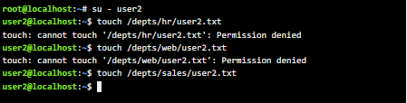

3. **Group Ownership of the Created File:**
   The group ownership of the file created in `/depts/sales` can be verified with the command:

   ```bash
   ls -l /depts/sales/user2.txt
   ```

   - **Expected Output:**
     ```
     -rw-rw---- 1 user2 sales <date> user2.txt
     ```
   - **Group Ownership:** `sales` (the group of the `/depts/sales` directory).

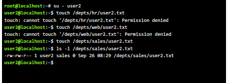

---

## Question 17 ❓

**Question:**  
Configure the `sudoers` file to allow `user3` and `user4` to use the `/bin/mount` and `/bin/umount` commands, while allowing `user5` only to use the `fdisk` command.


### 📝 Answer:

1. **Edit the Sudoers File:**
   Use the `visudo` command to safely edit the `sudoers` file. This ensures syntax checks before saving:

   ```bash
   sudo visudo
   ```

2. **Add Entries for Users:**
   In the `sudoers` file, add the following lines:

   ```bash
   user3 ALL=(ALL) NOPASSWD: /bin/mount, /bin/umount
   user4 ALL=(ALL) NOPASSWD: /bin/mount, /bin/umount
   user5 ALL=(ALL) NOPASSWD: /sbin/fdisk
   ```

   - **Explanation:**
     - `user3` and `user4` are granted permission to execute `/bin/mount` and `/bin/umount` without a password.
     - `user5` is granted permission to execute `/sbin/fdisk` without a password.
     - The `NOPASSWD` option allows them to run these commands without being prompted for their password.

3. **Save and Exit:**
   After adding the entries, save and exit the editor. In `visudo`, typically, you would press `Ctrl+X`, then `Y`, and `Enter`.

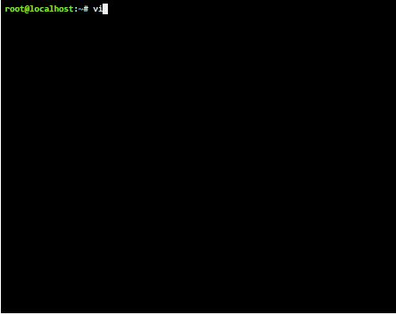


