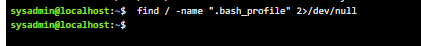
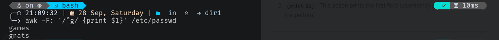

<p align="center">
  <a href="https://skillicons.dev">
    
  </a>
</p>

## Question 1 ❓

**Question:**  
How can I list all the available shells in a Unix system?

### 📝 Answer:

You can list all available shells on a Unix system by checking the `/etc/shells` file. This file contains the paths of all installed and available shells on your system.

To list the available shells, use the following command:

```bash
cat /etc/shells
```

### Example Output:

```bash
/bin/sh
/bin/bash
/usr/bin/bash
/usr/bin/sh
/bin/zsh
/usr/bin/zsh
```

This will display the available shells, which may include common ones like:
- `/bin/sh`: Bourne Shell  
- `/bin/bash`: Bourne Again Shell  
- `/bin/zsh`: Z Shell  
- `/bin/dash`: Debian Almquist Shell

Each shell represents a different command interpreter with its own features and syntax.

---

## Question 2 ❓

**Question:**  
What are the differences between various Unix shells?

### 📝 Answer:

Unix shells are command-line interpreters that allow users to interact with the operating system. Each shell has distinct features and capabilities. Here's a comparison of some of the most popular Unix shells:

### 1. **Bourne Shell (sh)**:
   - **Path**: `/bin/sh`
   - **Overview**: The original Unix shell, developed by Stephen Bourne. It is simple, lightweight, and ideal for scripting.
   - **Key Features**:
     - Basic scripting capabilities
     - Limited interactive features
     - Standard shell for scripting in many Unix-like systems

### 2. **Bourne Again Shell (bash)**:
   - **Path**: `/bin/bash`
   - **Overview**: An enhanced version of the Bourne shell, with more features for interactive use. It is the default shell on many Linux distributions.
   - **Key Features**:
     - Command history and tab completion
     - Shell scripting improvements
     - Customizable prompts
     - Supports arrays and regular expressions in scripts
   - **Best For**: General use, interactive tasks, and scripting

### 3. **C Shell (csh)**:
   - **Path**: `/bin/csh`
   - **Overview**: A shell developed by Bill Joy with a syntax resembling the C programming language.
   - **Key Features**:
     - C-like syntax for loops and conditionals
     - Built-in job control features
     - History substitution for command repetition
   - **Best For**: Users familiar with C syntax or performing scripting tasks with C-style logic

### 4. **Z Shell (zsh)**:
   - **Path**: `/bin/zsh`
   - **Overview**: A powerful and highly customizable shell that incorporates features from `bash`, `ksh`, and `tcsh`. It is favored by power users.
   - **Key Features**:
     - Extensive customization options
     - Advanced tab completion and autocorrection
     - Themes and plugins (often used with frameworks like Oh-My-Zsh)
     - Supports floating-point arithmetic and advanced globbing
   - **Best For**: Power users and those who want a highly customizable shell environment

### 5. **Korn Shell (ksh)**:
   - **Path**: `/bin/ksh`
   - **Overview**: Developed by David Korn, it offers a blend of the Bourne shell's simplicity with additional features.
   - **Key Features**:
     - Command aliasing and job control
     - Improved scripting features over `sh`
     - Compatibility with `sh` scripts
     - Supports associative arrays and floating-point arithmetic
   - **Best For**: Advanced scripting and tasks requiring compatibility with the Bourne shell

### 6. **Dash**:
   - **Path**: `/bin/dash`
   - **Overview**: A lightweight, fast implementation of the POSIX-compliant Bourne shell. It is often used as the `/bin/sh` shell in minimalistic or resource-constrained environments.
   - **Key Features**:
     - Optimized for speed and efficiency
     - Lacks some advanced features found in `bash`
     - Ideal for scripting in embedded systems or boot processes
   - **Best For**: Lightweight scripting where performance is key

---
> [!NOTE]
>### **Key Differences**:
>
>| **Shell**   | **Key Features**                               | **Best Used For**                     |
>|-------------|------------------------------------------------|---------------------------------------|
>| **Bourne**  | Simple, minimal, basic scripting                | Basic scripting and automation        |
>| **Bash**    | Command history, tab completion, arrays         | General use, interactive tasks, scripting |
>| **C Shell** | C-like syntax, job control, history substitution | Users familiar with C programming     |
>| **Z Shell** | Highly customizable, advanced completion        | Power users, customizable workflows   |
>| **Korn**    | Command aliasing, floating-point arithmetic     | Advanced scripting and automation     |
>| **Dash**    | Lightweight, fast, POSIX-compliant              | Lightweight environments, performance |

## Question 3 ❓

**Question:**  
How can I list all Linux commands in `/usr/bin` that start with the letter "w"?

### 📝 Answer:

To list all the commands in the `/usr/bin` directory that start with the letter "w," you can use the `ls` command with a wildcard (`*`) to match any file names beginning with "w".

The command is:

```bash
ls /usr/bin/w*
```

###  Output:


---

## Question 4 ❓

**Question:**  
How can I find all files in the `/etc` directory that are owned by the `lp` user?

### 📝 Answer:

You can use the `find` command to search for files owned by a specific user, such as `lp`, in the `/etc` directory. The command is:

```bash
find /etc -user lp
```

### Explanation:
- `/etc`: The directory where the search begins.
- `-user lp`: Specifies that you're looking for files owned by the `lp` user.

###  Output:


---

## Question 5 ❓

**Question:**  
How can I find all directories in my home directory?

### 📝 Answer:

You can use the `find` command to list all directories within your home directory. The command is:

```bash
find ~ -type d
```

### Explanation:
- `~`: Represents your home directory (e.g., `/home/username`).
- `-type d`: Specifies that you're looking for directories (`d` stands for directory).

### Output:
The command will list all directories, including subdirectories, in your home directory:


This will display all visible and hidden directories located under your home folder.

---
## Question 6 ❓

**Question:**  
How can I search for all files on the system with the name `.bash_profile`?

### 📝 Answer:

You can use the `find` command to search for files with the exact name `.bash_profile` across the entire system. To suppress error messages (like permission denied), redirect them to `/dev/null`. The command is:

```bash
find / -iname ".bash_profile" 2>/dev/null
```

### Explanation:
- `/`: Searches from the root directory, covering the entire system.
- `-iname ".bash_profile"`: Looks for files with the exact name `.bash_profile` without takecare about casecase sensitive.
- `2>/dev/null`: Redirects any error messages (e.g., permission errors) to `/dev/null` to avoid cluttering the output.

### Output:
The command will return the paths of any `.bash_profile` files it finds:




---

## Question 7 ❓

**Question:**  
How can I identify the file types of `/etc/passwd`, `/dev/pts/0`, and `/etc`?

### 📝 Answer:

You can use the `file` command to determine the file type of each of these files and directories. The command will display the file type along with additional details.

### Commands:

1. **For `/etc/passwd`:**
   ```bash
   file /etc/passwd
   ```

2. **For `/dev/pts/0`:**
   ```bash
   file /dev/pts/0
   ```

3. **For `/etc`:**
   ```bash
   file /etc
   ```

### Output:

1. **For `/etc/passwd`:**

   This indicates that `/etc/passwd` is a regular text file, typically containing user account information.

2. **For `/dev/pts/0`:**

   This indicates that `/dev/pts/0` is a character special file, which is a pseudo-terminal used for terminal emulation.

3. **For `/etc`:**

   This indicates that `/etc` is a directory, typically containing configuration files for the system.

---
## Question 8 ❓

**Question:**  
How can I list the inode numbers of `/`, `/etc`, `/etc/hosts`, `/etc/rc/`, and `/etc/rc.d/rc.d`?

### 📝 Answer:

You can use the `ls -i` command to display the inode numbers of files and directories. Inodes are unique identifiers for each file and directory on a Unix/Linux filesystem.

### Commands:

1. **For `/`:**
   ```bash
   ls -i /
   ```

2. **For `/etc`:**
   ```bash
   ls -i /etc
   ```

3. **For `/etc/hosts`:**
   ```bash
   ls -i /etc/hosts
   ```

4. **For `/etc/rc/`:**
   ```bash
   ls -i /etc/rc
   ```

5. **For `/etc/rc.d/rc.d`:**
   ```bash
   ls -i /etc/rc.d/rc.d
   ```

###  Output:


Each number next to the file or directory is its inode number.

---

## Question 9 ❓

**Question:**  
What happens if you execute the following commands?

### 📝 Answer:

### a. `cat filename1 | cat filename2`

**Explanation:**
only the conent of  filename2 will be in output 

### b. `ls | rm`

**Explanation:**

- This command attempts to list the contents of the current directory (`ls`) and then pass that list to `rm`.
- `rm` does not accept standard input in this manner; it expects file names as arguments.
- **Outcome:** You will likely receive an error such as:
  ```
  rm: missing operand
  Try 'rm --help' for more information.
  ```
- The command effectively does nothing and results in an error, as `rm` is not receiving any file names to delete.

### c. `ls /etc/passwd | wc -l`

**Explanation:**
- This command lists the contents of `/etc/passwd` and pipes the output to `wc -l`, which counts the number of lines.
- Since `/etc/passwd` is a file and not a directory, `ls /etc/passwd` will output the file name, resulting in a single line.
- **Outcome:** The output will be `1`, indicating that there is one line (the file name) in the output of the `ls` command.


---

## Question 10 ❓

**Question:**  
How can I create a Bash shell alias named `ls` for the `ls -l` command?

### 📝 Answer:

You can create an alias in your Bash shell by using the `alias` command. Here’s how to set an alias named `ls` to run `ls -l`:

### Command:

```bash
alias ls='ls -l'
```

### Steps to Create the Alias:

1. **Open your terminal.**
2. **Run the command above** to create the alias. This alias will only persist for the current session.
3. **To make the alias permanent**, add the alias command to your `~/.bashrc` file (or `~/.bash_profile` depending on your system). You can do this using a text editor, such as `nano`:

   ```bash
   nano ~/.bashrc
   ```

   Then add the line:

   ```bash
   alias ls='ls -l'
   ```

4. **Save the file and exit the editor.**
5. **Reload your `.bashrc` file** to apply the changes without needing to log out and back in:

   ```bash
   source ~/.bashrc
   ```

### Outcome:
Now, whenever you type `ls` in the terminal, it will execute `ls -l`, displaying the long format of the directory listing.


---

## Question 11 ❓

**Question:**  
How can I list the user commands and redirect the output to `/tmp/commands.list`?

### 📝 Answer:

You can list user commands by using the `history` command, which displays the command history for the current user session. To redirect the output to a file, you can use the `>` operator.

### Command:

```bash
history > /tmp/commands.list
```

### Explanation:

1. **`history`**: This command lists all the commands you have executed in the current shell session.
2. **`>`**: This operator redirects the output of the command on the left to the file specified on the right.
3. **`/tmp/commands.list`**: This is the file where the command output will be saved. If the file already exists, it will be overwritten.

### Outcome:
After running the command, you can check the contents of `/tmp/commands.list` by using:

```bash
cat /tmp/commands.list
```

This will display the list of user commands you have executed.


---

## Question 12 ❓

**Question:**  
How can I get all the user names whose first character in their login is ‘g’, using `awk` with another method?

### 📝 Answer:

You can achieve this by filtering the `/etc/passwd` file, which contains user account information. Each line in this file corresponds to a user account, and the username is the first field. 

### Using `awk`:

Here's a command using `awk`:

```bash
awk -F: '/^g/ {print $1}' /etc/passwd
```

### Explanation:

1. **`-F:`**: This option sets the field separator to `:`. The `/etc/passwd` file uses colons to separate fields.
2. **`/^g/`**: This pattern matches lines that start with the letter `g`. The caret (`^`) signifies the start of a line.
3. **`{print $1}`**: This action prints the first field (username) of lines that match the pattern.



---

## Question 13 ❓

**Question:**  
Write two commands: the first to search for all files on the system named `.bash_profile`, and the second to sort the output of the `ls` command on `/` recursively. Save their output and error in two different files and send them to the background.

### 📝 Answer:

You can combine the commands using a subshell and redirect the outputs as follows:

```bash
(find / -name .bash_profile > outputfind.txt 2> errorfind.txt; ls -R / > outputls.txt 2> errorls.txt) &
```

### Explanation:
- **`( ... )`**: This creates a subshell, allowing you to group commands together.
- **`find / -name .bash_profile > outputfind.txt 2> errorfind.txt`**:
  - Searches for all files named `.bash_profile` starting from the root directory.
  - Redirects standard output (normal messages) to `outputfind.txt`.
  - Redirects standard error (error messages) to `errorfind.txt`.
- **`;`**: Separates the two commands in the subshell.
- **`ls -R / > outputls.txt 2> errorls.txt`**:
  - Lists all files and directories recursively starting from the root directory.
  - Redirects standard output to `outputls.txt`.
  - Redirects standard error to `errorls.txt`.
- **`&`**: Sends the entire subshell command to the background, allowing you to continue using the terminal.

### Outcome:
Both commands will execute in the background, with their outputs and errors saved in the specified files. The search for `.bash_profile` files and the recursive listing of files will run simultaneously without blocking your terminal session.


---

## Question 14 ❓

**Question:**  
How can I display lines 7 to 10 of the `/etc/passwd` file using `awk` and another method that uses `tail` and `head`?

### 📝 Answer:

### Method 1: Using `awk`

You can use `awk` to display specific lines as follows:

```bash
awk 'NR>=7 && NR<=10' /etc/passwd
```

### Explanation:
- **`NR`**: Stands for "Number of Records" and represents the current line number.
- **`NR>=7 && NR<=10`**: This condition checks if the current line number is between 7 and 10.
- **`/etc/passwd`**: The input file from which lines will be read.


---

### Method 2: Using `tail` and `head`

You can also achieve this using a combination of `tail` and `head`:

```bash
tail -n +7 /etc/passwd | head -n 4
```

### Explanation:
1. **`tail -n +7 /etc/passwd`**:
   - **`-n +7`**: This option tells `tail` to start displaying from line 7 to the end of the file.
  
2. **`|`**: The pipe operator sends the output of the `tail` command as input to the `head` command.

3. **`head -n 4`**:
   - **`-n 4`**: This option tells `head` to display the first 4 lines from the output of the `tail` command, which corresponds to lines 7 to 10 of the original file.

### Outcome:
Both methods will display lines 7 to 10 of the `/etc/passwd` file.


---

## Question 15 ❓

**Question:**  
How can I list the environment variables in my current shell, and what is the difference between `printenv`, `env`, and `set`?

### 📝 Answer:

To display the environment variables in your current shell, you can use the following commands:

### 1. Using `printenv`

```bash
printenv
```

#### Explanation:
- **`printenv`**: This command is used to display only the environment variables. It shows all variables that have been set with specific values. It is a straightforward option for getting a list of environment variables.

### 2. Using `env`

```bash
env
```


#### Explanation:
- **`env`**: Similar to `printenv`, this command displays the environment variables. However, it also allows you to run a command in a modified environment. When you just run `env`, it shows the current environment variables.


### 3. Using `set`

```bash
set
```

#### Explanation:
- **`set`**: This command displays all variables, including environment variables, shell functions, and local variables. It provides a much broader overview compared to `printenv` and `env`, showing user-defined variables in addition to environment variables.


### Differences Between `printenv`, `env`, and `set`:

| Command      | Displays Environment Variables | Displays Shell Functions | Displays Local Variables | Allows Running Commands in Modified Environment |
|--------------|-------------------------------|-------------------------|-------------------------|------------------------------------------------|
| `printenv`   | Yes                           | No                      | No                      | No                                             |
| `env`        | Yes                           | No                      | No                      | Yes                                            |
| `set`        | Yes                           | Yes                     | Yes                     | No                                             |

### Outcome:
- **`printenv`** is best for a quick view of environment variables.
- **`env`** serves a dual purpose: viewing environment variables and running commands in a modified environment.
- **`set`** provides the most comprehensive information, showing all shell variables and functions, making it useful for analyzing the overall current shell environment.

---

## Question 16 ❓

**Question:**  
What are the commands that list the values of all the variables in the shell?

### 📝 Answer:

To list the values of all the variables in the shell, you can use the following commands:

### 1. Using `set`

```bash
set
```

#### Explanation:
- The **`set`** command displays all shell variables, including environment variables, shell functions, and local variables, along with their values. This command provides a comprehensive overview of the current shell's variable settings.

### 2. Using `declare` (Bash specific)

```bash
declare -p
```

#### Explanation:
- The **`declare -p`** command shows all defined variables along with their values in a format that can be reused in scripts. This is particularly useful in `bash`, as it allows you to see the variables that are currently set and their types.

### 3. Using `env`

```bash
env
```

#### Explanation:
- The **`env`** command lists all environment variables and their values. While it primarily focuses on environment variables, it is still useful for seeing a subset of all variables available in the current session.

### Outcome:
- Using **`set`** will give you the most complete listing of all variables, while **`declare -p`** provides a more structured view for `bash`. **`env`** focuses on environment variables specifically.

---

## Question 17 ❓

**Question:**  
What are the commands that list the value of a specific variable in the shell, including the use of `printenv`?

### 📝 Answer:

To list the value of a specific variable in the shell, you can use the following commands:

### 1. Using `echo`

```bash
echo $VARIABLE_NAME
```

#### Explanation:
- The **`echo`** command prints the value of a specific variable. Replace `VARIABLE_NAME` with the name of the variable you want to check. For example, to view the value of the `PATH` variable, you would use:
  ```bash
  echo $PATH
  ```

### 2. Using `printf`

```bash
printf "%s\n" "$VARIABLE_NAME"
```

#### Explanation:
- The **`printf`** command can also display the value of a variable, offering more formatting options. For instance:
  ```bash
  printf "%s\n" "$HOME"
  ```

### 3. Using `printenv`

```bash
printenv VARIABLE_NAME
```

#### Explanation:
- The **`printenv`** command is used to display the value of a specific environment variable. For example:
  ```bash
  printenv HOME
  ```
  If `HOME` is set, this command will output its value. If the variable is not set, it will return nothing.

### 4. Using `declare` (Bash specific)

```bash
declare -p VARIABLE_NAME
```

#### Explanation:
- The **`declare`** command can display the attributes and value of a specific variable in `bash`. For example:
  ```bash
  declare -p MY_VAR
  ```

### Outcome:
- Use **`echo`** for general variables, **`printenv`** for environment variables specifically, and **`printf`** for formatted output. **`declare`** provides additional information about the variable's attributes if needed.


---

## Question 18 ❓

**Question:**  
How can you display your current shell in the terminal?

### 📝 Answer:

To display your current shell, you can use the following command:

### Using `echo`

```bash
echo $SHELL
```

#### Explanation:
- The **`echo $SHELL`** command prints the value of the `SHELL` environment variable, which contains the path to the current shell you are using. 
- you can use `$0` to see the type of shell if it `bash` or `zsh`
### Alternative Method

### Using `ps`

```bash
ps -p $$
```

#### Explanation:
- The **`ps -p $$`** command displays the process information for the current shell process. The output will include the name of the shell you are currently using.

### Outcome:
- Either method will effectively show you the current shell you are operating in, with the first method being the most straightforward.


---

## Question 19 ❓

**Question:**  
What is the difference between startup files and initialization files? State the startup file of `bash` and the initialization file of `bash`.

### 📝 Answer:

### Differences between Startup Files and Initialization Files

1. **Startup Files**:
   - **Purpose**: Startup files are executed when a user starts a new login shell session. They are primarily used to set up the user environment.
   - **Examples**: The system executes global and user-specific startup files to configure the shell environment upon login.
   - **Loading Sequence**: 
     - The global profile is loaded first, specifically **`/etc/profile`**, followed by any scripts in **`/etc/profile.d/`**.
     - Then, for user-specific profiles, the system checks the following in order:
       1. **`~/.bash_profile`**
       2. **`~/.bash_login`**
       3. **`~/.profile`**  
     - Only one of these three files will be executed based on the presence of the file, starting with `~/.bash_profile`.

2. **Initialization Files**:
   - **Purpose**: Initialization files configure the shell environment for interactive non-login shells. These files contain user-specific settings, such as aliases and functions.
   - **Example**: The initialization file for `bash` is typically **`~/.bashrc`**.
   - **Loading Sequence**: After executing the user-specific startup file, **`~/.bashrc`** is loaded. This file is executed every time a new terminal session is started (unless the shell is a login shell).

### Summary of Key Files in `bash`

- **Startup File**: 
  - **Global**: `/etc/profile` 
  - **User-specific**: `~/.bash_profile`, `~/.bash_login`, or `~/.profile` (in that order)
  
- **Initialization File**: 
  - **`~/.bashrc`** (loaded after the user-specific startup file)

### Important Note:
- The **`.bashrc`** file is crucial as it runs every time a new terminal session is opened, allowing for dynamic configurations. In some systems, it may also be named **`.bash.bashrc`**.

---

## Question 20 ❓

**Question:**  
Edit your profile to display the date at login and change your prompt permanently.

### 📝 Answer:

To display the date at login and change your shell prompt permanently, you need to edit your `~/.bash_profile` or `~/.bashrc` file. Here’s how to do it:

### Steps to Edit Your Profile:

1. **Open your Profile File**:
   You can choose to edit either **`~/.bash_profile`** (for login shells) or **`~/.bashrc`** (for interactive non-login shells). Here, we'll use **`~/.bash_profile`** as an example:
   ```bash
   nano ~/.bash_profile
   ```
   Alternatively, use your preferred text editor (like `vim` or `gedit`).

2. **Add the Date Command**:
   At the end of the file, add the following line to display the current date when you log in:
   ```bash
   echo "Today's date is: $(date)"
   ```

Here’s the explanation for customizing your shell prompt to include the time along with your username and current directory:

### Change Your Prompt with Time

You can customize your shell prompt by setting the `PS1` variable. For example, to set the prompt to include your username, current directory, and the current time in 12-hour format, you can add:

```bash
PS1="\u@\h:\w $(date +%I:%M\ %p)$ "
```

### Components Explained:
- **`\u`**: Username of the current user
- **`\h`**: Hostname up to the first dot
- **`\w`**: Current working directory
- **`$(date +%I:%M\ %p)`**: Executes the `date` command to display the current time in 12-hour format with AM/PM

This configuration will display the prompt in the format: `username@hostname:current_directory current_time$ `


Feel free to adjust the time format as needed!
1. **Save and Exit**:
   If you're using `nano`, press `CTRL + O` to save and `CTRL + X` to exit. If you're using `vim`, type `:wq` and hit `Enter`.

2. **Apply the Changes**:
   To make the changes take effect without restarting your terminal, source the profile:
   ```bash
   source ~/.bash_profile
   ```


--- 

### Question 21 ❓

**Question:**  
What happens when you execute the command `echo \` and then press enter?

### 📝 Answer:

When you execute the command:

```bash
echo \
```

and then press Enter, the following occurs:

- **Backslash (`\`) Behavior**: In the context of the shell, the backslash is used as an escape character. It tells the shell that the next character should be treated differently. When the backslash is placed at the end of the line and you press Enter, the shell expects more input because it indicates that the command continues onto the next line.

- **No Output**: As a result, the shell will not produce any output yet; instead, it will give you a secondary prompt (usually `>`) indicating that it is waiting for you to complete the command.

### Example Interaction

1. You enter:
   ```bash
   echo \
   ```
2. The terminal responds with:
   ```
   >
   ```
3. At this point, the shell is waiting for you to provide additional input. To terminate the command without producing output, you can press `Ctrl+C` to cancel.


---


### Question 22 ❓

**Question:**  
How do you issue the command `sleep 100`, stop the last command, resume it in the background, and then check the jobs?

### 📝 Answer:

1. **Issue the Command:**
   Start by issuing the command to pause for 100 seconds:
   ```bash
   sleep 100
   ```

2. **Stop the Last Command:**
   To stop the `sleep` command that is currently running, press `Ctrl + Z`. This sends the `SIGTSTP` signal, which pauses the command and puts it in the background. You will see an output similar to:
   ```
   [1]+  Stopped                 sleep 100
   ```

3. **Resume the Last Command in the Background:**
   To resume the `sleep` command in the background, use the `bg` command:
   ```bash
   bg
   ```

   This will output something like:
   ```
   [1]+ sleep 100 &
   ```

4. **Issue the Jobs Command:**
   Finally, to see the list of jobs running in the background, issue the `jobs` command:
   ```bash
   jobs
   ```

   This will display output similar to:
   ```
   [1]+  Running                 sleep 100 &
   ```


### Question 26 ❓

**Question:**  
How do you send the `sleep` command to the foreground, then send it again to the background, and finally kill the `sleep` command?

### 📝 Answer:

1. **Send the Sleep Command to the Foreground:**
   If the `sleep` command is already running in the background, you can bring it to the foreground using the `fg` command. If you have multiple jobs, specify the job number:
   ```bash
   fg %1
   ```
   This will bring the first job (in this case, `sleep`) to the foreground.

2. **Send it Again to the Background:**
   After the `sleep` command is in the foreground, you can send it to the background by stopping it again using `Ctrl + Z`, and then using the `bg` command:
   ```bash
   Ctrl + Z  # Stop the command
   bg        # Send it back to the background
   ```

3. **Kill the Sleep Command:**
   To terminate the `sleep` command running in the background, you need to use the `kill` command followed by the job number or the process ID (PID). To find the job number, you can use the `jobs` command:
   ```bash
   jobs
   ```

   This will show output similar to:
   ```
   [1]+  Running                 sleep 100 &
   ```

   Now, you can kill it using:
   ```bash
   kill %1  # If the job number is 1
   ```

   Alternatively, if you want to use the PID, find it using the `ps` command:
   ```bash
   ps aux | grep sleep
   ```

   This will give you the PID of the `sleep` command. Use it to kill:
   ```bash
   kill <PID>
   ```


---

### Question 27 ❓

**Question:**  
How do you display only your processes in a Unix/Linux system?
Use the pgrep command to list your processes only ?
### 📝 Answer:

To display only your processes, you can use the `ps` command with specific options that filter for processes owned by the current user. Here are a couple of common methods:

1. **Using `ps` with `-u` option**:
   ```bash
   ps -u $USER
   ```
   This command will display a list of processes along with their details for the user specified by the environment variable `$USER`, which refers to the current user.

2. **Using `ps` with `-f` option**:
   ```bash
   ps -f -u $USER
   ```
   The `-f` option provides a full-format listing, showing more details about each process.

3. **Using `pgrep`**:
   If you want a simpler output, you can use:
   ```bash
   pgrep -u $USER
   ```
   This will display only the process IDs (PIDs) of the processes owned by the current user.

4. **Using `top` or `htop`**:
   You can also use interactive process viewers like `top` or `htop` to view your processes. In `top`, you can filter for your processes:
   - Just run `top` and press `u` to specify the user.
   - Then enter your username.


### Question 27 ❓

**Question:**  
How can you display all processes except yours in a Unix/Linux system?

### 📝 Answer:

To display all processes except those owned by the current user, you can use the `ps` command in combination with `grep` or `awk`. Here’s how to do it:

1. **Using `ps` with `awk`**:
   ```bash
   ps aux | awk -v user="$(whoami)" '$1 != user'
   ```
   - In this command, `ps aux` lists all processes, and `awk` checks if the first column (the user) is not equal to the current username.

2. **Using `pgrep`**:
   ```bash
   pgrep -v -u "$(whoami)"
   ```
   - This command lists the process IDs of all processes except those owned by the current user.
   - instead of` "$(whoami)"` you can use `$USER`  the variable  
    


To kill all your processes, you can use the `pkill` command or combine `pgrep` with `kill`. Here are the methods:

### Method 1: Using `pkill`
You can simply use:
```bash
pkill -u $(whoami)
```

### Method 2: Using `pgrep` and `kill`
If you prefer to see the PIDs before killing them, you can first list your processes and then kill them:
1. List your processes:
   ```bash
   pgrep -u $(whoami)
   ```
2. Kill your processes:
   ```bash
   kill $(pgrep -u $(whoami))
   ```

### Explanation
- **`pkill -u $(whoami)`**: This command directly kills all processes owned by the current user.
- **`pgrep -u $(whoami)`**: This lists the PIDs of your processes.
- **`kill $(pgrep -u $(whoami))`**: This kills the processes based on the PIDs obtained from the previous command.

>[!CAUTION]
>-  Be careful when using these commands, as they >will terminate all processes owned by the user, which may > include important applications.
> - You may need superuser privileges to kill certain processes, especially if they are running with higher privileges.
 