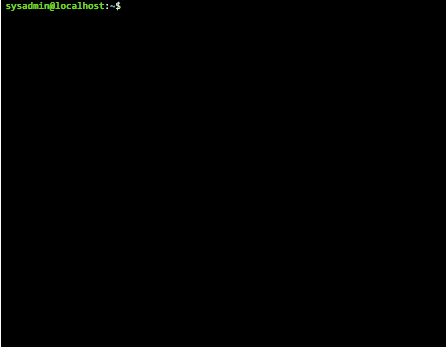
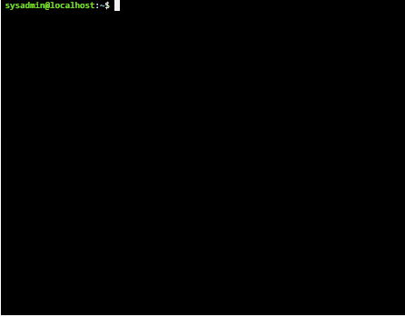
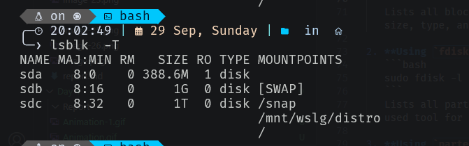
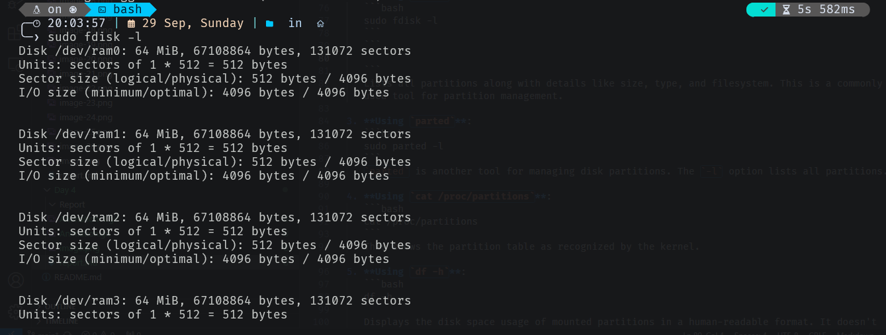
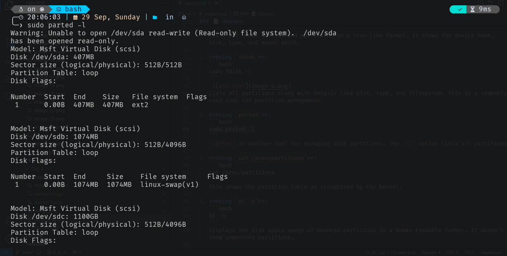
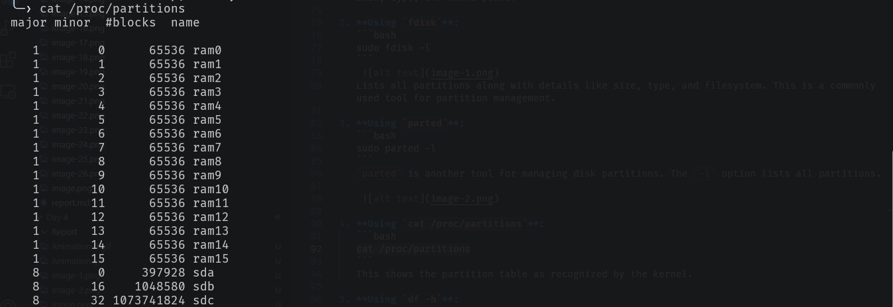
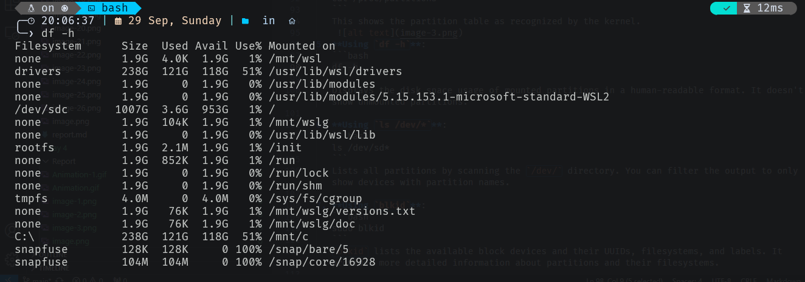
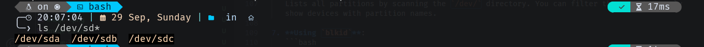
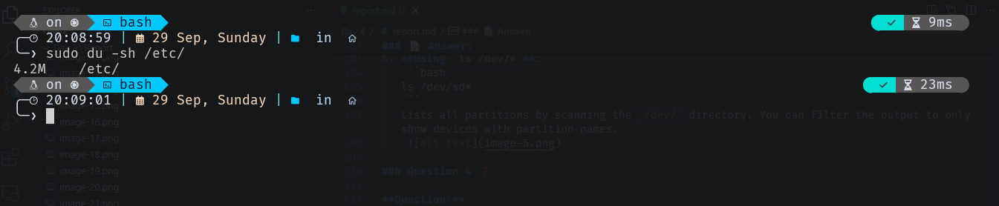

<p align="center">
  <a href="https://skillicons.dev">
    
  </a>
</p>


### Question 1 ❓

**Question:**  
How can I create a symbolic link of `/etc/passwd` in the home directory with the name `users`?

### 📝 Answer:

To create a symbolic link from the file `/etc/passwd` to a new link called `users` in your home directory (`~`), you can use the `ln` command with the `-s` option for creating symbolic links.

The command is:

```bash
ln -s /etc/passwd ~/users
```

### Explanation:
- `ln`: The command used to create links in Linux.
- `-s`: This option tells `ln` to create a symbolic (soft) link.
- `/etc/passwd`: The source file you want to link.
- `~/users`: The name and location of the symbolic link you are creating (in this case, `users` in your home directory).

#### Output:



### Question 2 ❓

**Question:**  
Can you create a hard link of `/etc/passwd` in your home directory with the name `users.hard`? If not, why?

### 📝 Answer:

To create a hard link, you would typically use the `ln` command without the `-s` option. The command would be:

```bash
ln /etc/passwd ~/users.hard
```

However, **you cannot create a hard link across different filesystems**. The reason you can't create a hard link from `/etc/passwd` to `~/users.hard` in your home directory is because `/etc` is typically located on a different filesystem (root `/` filesystem), while your home directory is usually located on a separate partition.

#### Explanation:
- **Hard links** must exist on the same filesystem because they reference the same inode (the actual data structure on the disk), and inodes are specific to a filesystem.
- **Symbolic links (soft links)**, on the other hand, can span across filesystems because they point to the path of the target file, rather than the inode itself.

#### Output




### Question 3 ❓

**Question:**  
How can you display the partitions in the system?

### 📝 Answer:

Here are **7 different ways** to display the partitions in a Linux system:

1. **Using `lsblk`**:
   ```bash
   lsblk
   ```
   
   
   Lists all block devices and partitions in a tree-like format. It shows the device name, size, type, and mount point.

2. **Using `fdisk`**:
   ```bash
   sudo fdisk -l
   ```
    
   Lists all partitions along with details like size, type, and filesystem. This is a commonly used tool for partition management.

3. **Using `parted`**:
   ```bash
   sudo parted -l
   ```
   `parted` is another tool for managing disk partitions. The `-l` option lists all partitions.

     

4. **Using `cat /proc/partitions`**:
   ```bash
   cat /proc/partitions
   ```
   This shows the partition table as recognized by the kernel.
    
5. **Using `df -h`**:
   ```bash
   df -h
   ```
   Displays the disk space usage of mounted partitions in a human-readable format. It doesn't show unmounted partitions.
    

6. **Using `ls /dev/*`**:
   ```bash
   ls /dev/sd*
   ```
   Lists all partitions by scanning the `/dev/` directory. You can filter the output to only show devices with partition names.
    

### Question 4 ❓

**Question:**  
How can you determine the size of the `/etc` directory using the `du` command?

### 📝 Answer:

You can use the following command to determine the size of the `/etc` directory:

```bash
du -sh /etc
```

- `du`: Disk Usage command.
- `-s`: Summarize the total size.
- `-h`: Display the size in a human-readable format (e.g., KB, MB, GB).

This will give you the total size of the `/etc` directory.

